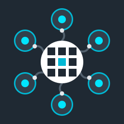

<p align="center">
  
</p>

<h1 align="center">100pixel AI Agent Connector</h1>

<p align="center">
  <strong>Connect Claude, ChatGPT &amp; AI agents to WordPress &amp; WooCommerce.</strong><br>
  A free WordPress plugin that turns your site into an MCP server. By <a href="https://100pixel.com">100pixel.com</a>.
</p>

<p align="center">
  
  
  
  
</p>

---

100pixel AI Agent Connector adds a [Model Context Protocol](https://modelcontextprotocol.io) (MCP) server to WordPress. Once it's installed, AI assistants such as **Claude, ChatGPT, Cursor, VS Code Copilot, Gemini CLI and Windsurf** can work on your site for you: write and publish posts, upload images, change settings, manage plugins and run your WooCommerce store.

Every action runs as the WordPress user who owns the API key, so an AI agent can never do more than that user is allowed to do.

## Features

- **28 built-in tools** for posts, pages, custom post types, taxonomies, media, site settings, plugins, themes, users and WooCommerce
- **Works with any MCP client** over Streamable HTTP, with ready-made setup for the most popular AI apps
- **Setup prompts**: paste one message into Claude Code, Cursor, VS Code, Gemini CLI or Windsurf and the AI connects itself
- **Per-user API keys** that you can revoke at any time
- **Read-only mode**, per-group tool toggles and role-based access control
- **WooCommerce ready**, including High-Performance Order Storage (HPOS)
- **WordPress Abilities API** bridge (WordPress 6.9+)
- No tracking, no external services, no account needed

## Installation

1. Download the latest zip from [100pixel.com/plugins/agentpress-mcp](https://100pixel.com/plugins/agentpress-mcp).
2. In WordPress, go to **Plugins → Add New → Upload Plugin**, upload the zip and activate it.
3. Open **AI Agent Connector** in the admin menu and click **Generate key**.
4. Pick your AI app. The plugin shows step-by-step instructions with your key and site URL already filled in.

## Connecting your AI app

The server URL is:

```
https://your-site.com/wp-json/mcp100p/v1/mcp
```

Send your API key in one of three ways:

| Method | Use it for |
|---|---|
| `Authorization: Bearer YOUR_API_KEY` header | Claude Code, Cursor, VS Code, Gemini CLI, Windsurf |
| `X-API-Key: YOUR_API_KEY` header | Hosts that strip the Authorization header |
| Key in the URL: `…/wp-json/mcp100p/v1/mcp/YOUR_API_KEY` | Claude (web & desktop) and ChatGPT, which can't send custom headers. Admins can turn this off. |

<details>
<summary><strong>Claude (web &amp; desktop)</strong></summary>

Open **Settings → Connectors → Add custom connector** and paste your server URL with the key included (shown in the plugin). Leave the OAuth fields empty.
</details>

<details>
<summary><strong>ChatGPT</strong></summary>

Open **Plugins**, click **Add**, choose **Create MCP app**, enter a name and description, choose **No authentication**, paste your server URL with the key included and click **Connect**.
</details>

<details>
<summary><strong>Claude Code</strong></summary>

```bash
claude mcp add --transport http wordpress https://your-site.com/wp-json/mcp100p/v1/mcp --header "Authorization: Bearer YOUR_API_KEY"
```
</details>

<details>
<summary><strong>Cursor</strong></summary>

Add to `~/.cursor/mcp.json` or `.cursor/mcp.json` in your project:

```json
{
  "mcpServers": {
    "wordpress": {
      "url": "https://your-site.com/wp-json/mcp100p/v1/mcp",
      "headers": { "Authorization": "Bearer YOUR_API_KEY" }
    }
  }
}
```
</details>

<details>
<summary><strong>VS Code (GitHub Copilot)</strong></summary>

Add to `.vscode/mcp.json` in your workspace:

```json
{
  "servers": {
    "wordpress": {
      "type": "http",
      "url": "https://your-site.com/wp-json/mcp100p/v1/mcp",
      "headers": { "Authorization": "Bearer YOUR_API_KEY" }
    }
  }
}
```
</details>

<details>
<summary><strong>Gemini CLI</strong></summary>

Add to `~/.gemini/settings.json`:

```json
{
  "mcpServers": {
    "wordpress": {
      "httpUrl": "https://your-site.com/wp-json/mcp100p/v1/mcp",
      "headers": { "Authorization": "Bearer YOUR_API_KEY" }
    }
  }
}
```
</details>

<details>
<summary><strong>Windsurf</strong></summary>

Add to `~/.codeium/windsurf/mcp_config.json`:

```json
{
  "mcpServers": {
    "wordpress": {
      "serverUrl": "https://your-site.com/wp-json/mcp100p/v1/mcp",
      "headers": { "Authorization": "Bearer YOUR_API_KEY" }
    }
  }
}
```
</details>

<details>
<summary><strong>Test with curl</strong></summary>

```bash
curl -s https://your-site.com/wp-json/mcp100p/v1/mcp \
  -H "Content-Type: application/json" \
  -H "Accept: application/json, text/event-stream" \
  -H "X-API-Key: YOUR_API_KEY" \
  -d '{"jsonrpc":"2.0","id":1,"method":"tools/list"}'
```
</details>

## Tools

| Group | Tools |
|---|---|
| Site overview | `wp_site_info` |
| Posts, pages & custom post types | `wp_list_posts`, `wp_get_post`, `wp_create_post`, `wp_update_post`, `wp_delete_post`, `wp_list_terms`, `wp_create_term` |
| Media library | `wp_list_media`, `wp_upload_media`, `wp_update_media`, `wp_delete_media` |
| Users (read-only) | `wp_list_users`, `wp_get_user` |
| Site settings | `wp_get_settings`, `wp_update_settings` |
| Plugins & themes | `wp_list_plugins`, `wp_activate_plugin`, `wp_deactivate_plugin`, `wp_list_themes`, `wp_activate_theme` |
| WooCommerce | `wc_list_products`, `wc_get_product`, `wc_create_product`, `wc_update_product`, `wc_list_orders`, `wc_get_order`, `wc_update_order` |
| WordPress Abilities | `ability__*`, added automatically for abilities marked public for MCP |

### Example prompts

- *"Write an 800-word post about winter skincare, add it to the Tips category and save it as a draft."*
- *"Find every image without alt text and write descriptive alt text for each."*
- *"Put all products in the Shoes category on a 20% sale."*
- *"Which WooCommerce orders are still processing? Mark order 1042 as completed."*

## Security

- API keys are random 40-character secrets. Only a SHA-256 hash is used to verify them, and the latest key is stored encrypted with your site's secret salts so the admin screen can show your connection URL.
- Every tool checks the key owner's normal WordPress capabilities.
- Administrators choose which roles can create keys, which tool groups are offered, and can switch on read-only mode.
- The site URL, admin email, user registration and default role can never be changed through MCP.
- The plugin sends no data to 100PIXEL or any third party.

## Requirements

- WordPress 6.4 or newer (tested up to 7.1)
- PHP 7.4 or newer
- The WordPress REST API must be reachable (`/wp-json/`)
- WooCommerce is optional

## Extending

Other plugins can add their own tools:

```php
add_action( 'mcp100p_register_tools', function () {
	MCP100P_Tools::add( array(
		'name'        => 'my_tool',
		'description' => 'What the tool does.',
		'input'       => array( 'foo' => array( 'type' => 'string' ) ),
		'required'    => array( 'foo' ),
		'read_only'   => true,
		'callback'    => function ( $args ) {
			return array( 'ok' => true );
		},
	) );
} );
```

You can also register a WordPress Ability (Abilities API, WordPress 6.9+) with `meta.mcp.public = true`.

## Support

Need help connecting the plugin to your AI / LLM? Email **[support@100pixel.com](mailto:support@100pixel.com)**.

Found a bug or have an idea? [Open an issue](https://github.com/himanshu01052003/AgentPress/issues).

## License

[GPL-2.0-or-later](LICENSE). App logos are from [Simple Icons](https://simpleicons.org/) (CC0 1.0). All product names and logos are trademarks of their respective owners, and their use does not imply endorsement.

---

<p align="center">Built by <a href="https://100pixel.com">100PIXEL</a></p>
